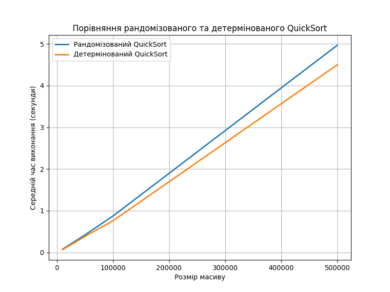

# GoIT Algo 2 HW 10

## Task 1 - Порівняння рандомізованого та детермінованого QuickSort

|N  |Розмір масиву  |Рандомізований QuickSort (s)  |Детермінований QuickSort (s)
|:--:|:----:|:----:|:----:|
|0          |10000                      |0.076166                      |0.066503
|1          |50000                      |0.419651                      |0.382874
|2         |100000                      |0.872724                      |0.759730
|3         |500000                      |4.965393                      |4.497566

|N  |Розмір масиву  |Рандомізований QuickSort (s)  |Детермінований QuickSort (s)
|:--:|:----:|:----:|:----:|
|0          |10000                      |0.080479                      |0.069336
|1          |50000                      |0.442252                      |0.417324
|2         |100000                      |0.930817                      |0.787073
|3         |500000                      |4.803128                      |4.296120

### Спостереження:
 + Детермінований QuickSort зазвичай працює трохи швидше, ніж рандомізований QuickSort.
 + Різниця в продуктивності зростає зі збільшенням розміру масиву, ймовірно, завдяки кращому вибору вершини у детермінованій версії, що зменшує кількість найгірших сценаріїв.
 + На практиці обидва алгоритми демонструють приблизно O(n log n) складність.

## Task 2 - Створення розкладу за жадібним алгоритмом

### Розклад занять:
+ Наталія Шевченко, 29 років, email: n.shevchenko@example.com
   - Викладає предмети: Біологія, Хімія

+ Дмитро Бондаренко, 35 років, email: d.bondarenko@example.com
   - Викладає предмети: Інформатика, Фізика

+ Олександр Іваненко, 45 років, email: o.ivanenko@example.com
   - Викладає предмети: Математика

#### Аналіз розподілу:
* Жадібний алгоритм вибирає викладачів так, щоб максимально охопити предмети з мінімальною кількістю персоналу.
* Віддає перевагу викладачам, які можуть викладати більше предметів, і при рівних умовах – наймолодшому.
* Усі предмети покриті.